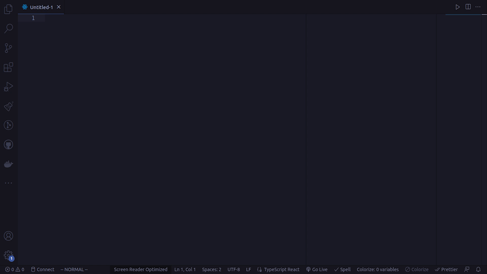
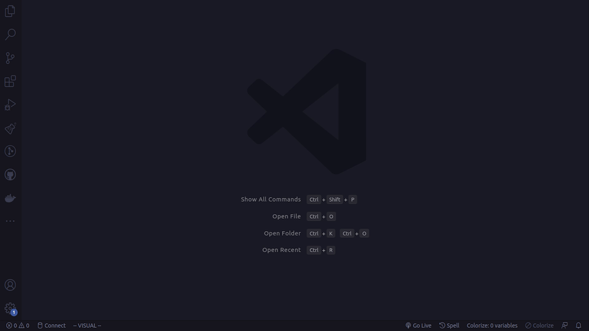
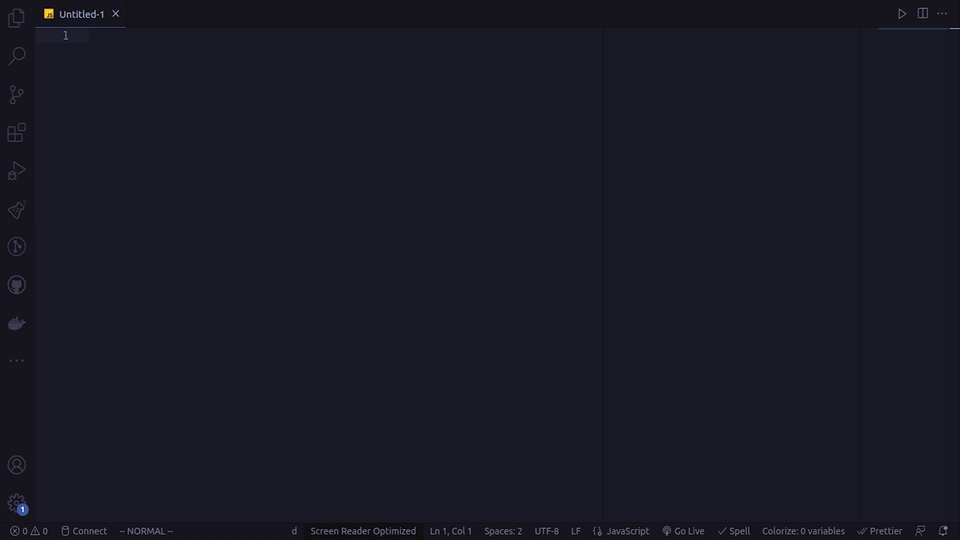
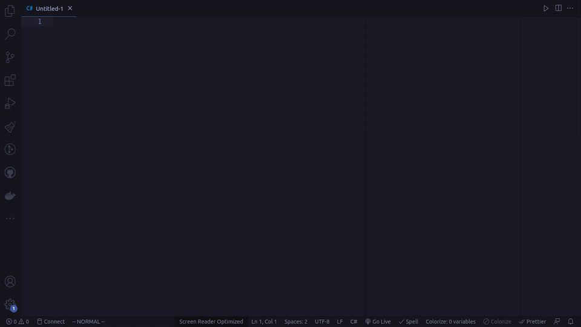
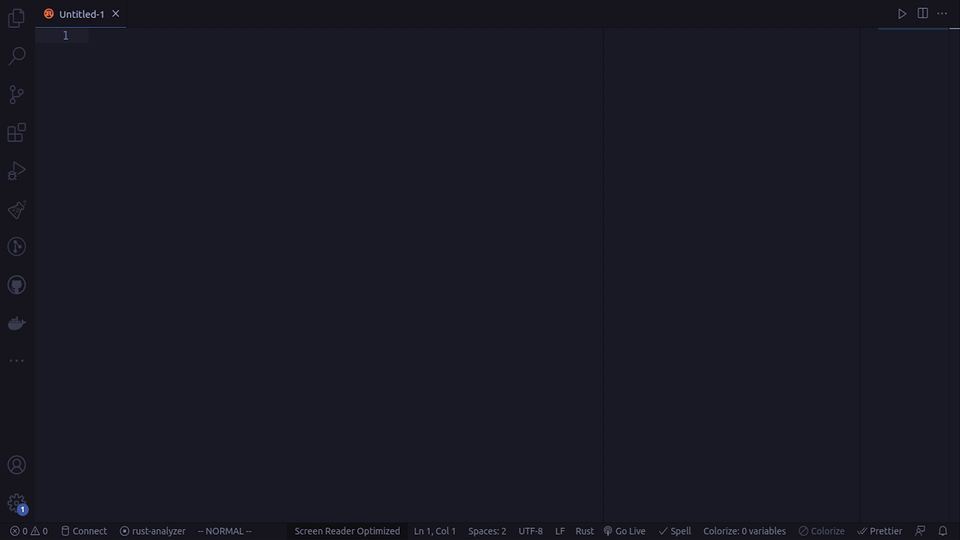
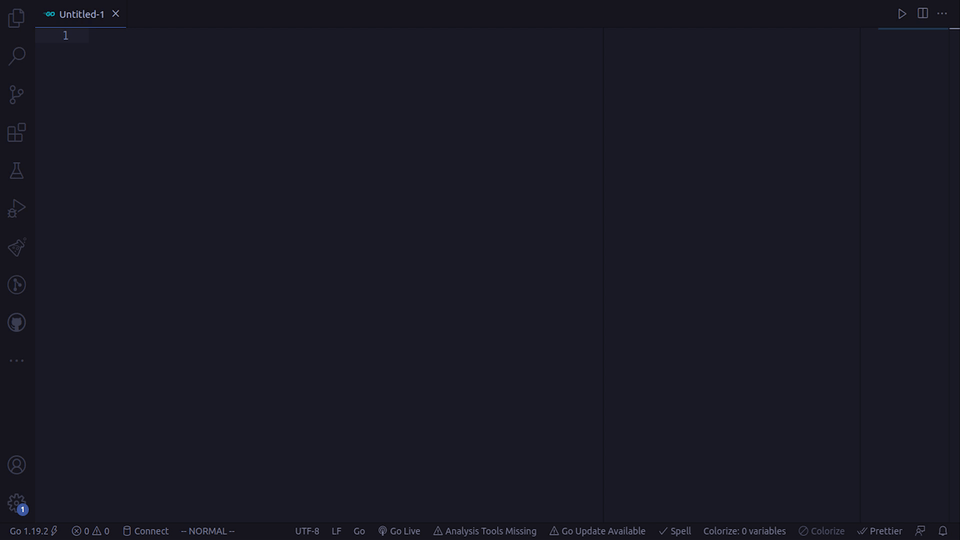
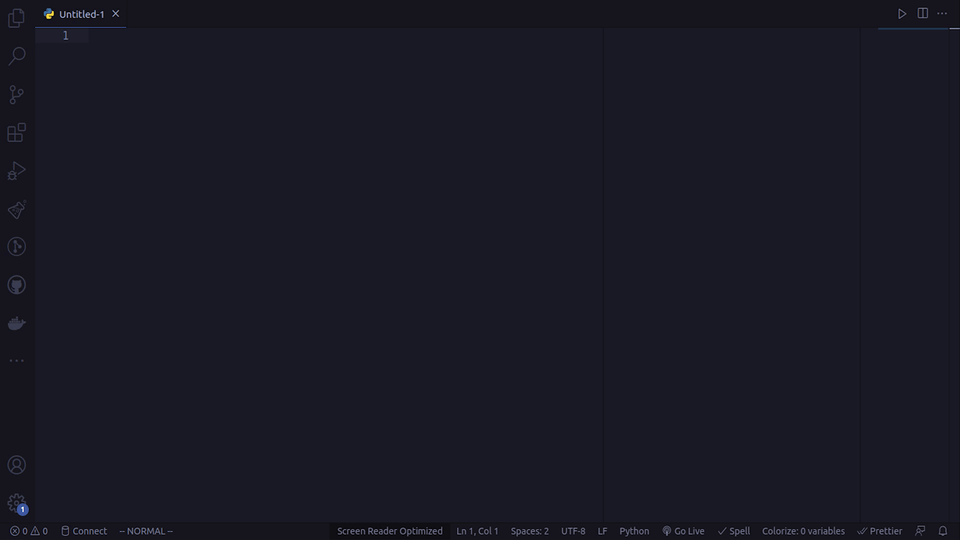

# 💻 VSCode Writer 
Introducing VSCode Writer - the VSCode extension that simplifies code writing and refactoring for developers. With VSCode Writer, you can easily decouple your code, generate unit tests, and get more done in less time.
## Demo

## 📝 Features
- Write code quickly by asking VSCode Writer to do it for you
- Refactor your code with one simple command
- Decouple your code to make it more modular and maintainable
- Generate unit tests for your selected code with ease

## ⚙ Setup 

To create a new API key on OpenAI's website, follow these steps:
1. Go to the [OpenAI website](https://openai.com/) and either log in to your existing account or create a new account.

2. Once you are logged in, click on your account image in the top right corner of the screen.

3. From the drop-down menu, select the option to "View API Keys."

4. On the API Keys page, click the button to "Create a new key."

5. Execute `setup` command and paste the API key.

## 🤔 How It Works 
VSCode Writer uses GPT-3 to understand your natural language instructions and generate high-quality code. With VSCode Writer, you can write and refactor your code faster and with less effort.  

## Examples
### React

### JavaScript

### .NET/C#

### Rust

### Go

### Python

### Java

### ⚡️ Try VSCode Writer Today ⚡️
Install VSCode Writer now and discover the future of code writing and refactoring. 