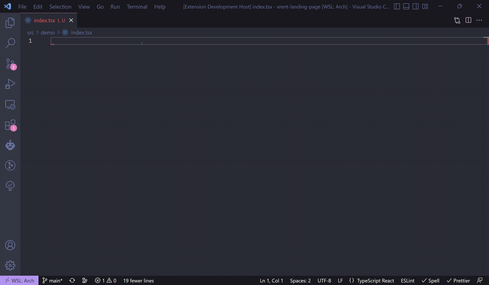

# 💻 **GPT Coder**
Use OpenAI's powerful GPT-3 directly from your favorite IDE 🤖

## 🤯 Features
### 🖊️ **Write code** more efficiently with _GPT Coder_'s assistance.

### 🧪 **Generate unit tests** with a single selection (~10 seconds)  

## 🤔 How It Works 
GPT Coder uses GPT-3 to understand your natural language instructions and generate **high-quality** code.    

## ⚙ Setup 
As the extension uses GPT-3 model from OpenAI, you'll need to have an API key from OpenAI.

To create a new API key on OpenAI's website, follow these steps:  
1. Go to the [OpenAI website](https://openai.com/) log in to your account or create a new one.

2. Once you are logged in, click on your account image in the top right corner of the screen.

3. From the drop-down menu, select the option to "View API Keys."

4. On the API Keys page, click the button to "Create a new key."

5. Execute `setup` command and paste the API key.

## Supported Languages
_GPT Coder_ is compatible with the following languages:
- [React](#react)
- [JavaScript](#javascript)
- [.NET / C#](#netc)
- [Rust](#rust)
- [Go](#go)
- [Python](#python)
- [Java](#java)

## Examples
### React

### JavaScript

### .NET/C#

### Rust

### Go

### Python

### Java

### ⚡️ Try GPT Coder Today ⚡️
- Install GPT Coder now and discover the future of code writing.